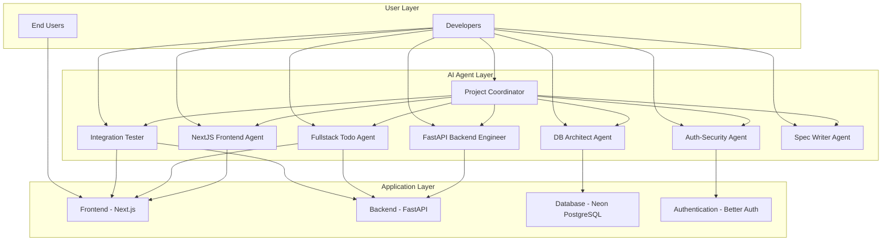

# 🤖 TaskMaster Pro - AI Agent Architecture & Design

## 🎯 Overview

TaskMaster Pro is built using a revolutionary AI-assisted development approach that leverages specialized agents to handle different aspects of the application. This document outlines the architecture, design principles, and functionality of each specialized agent.

## 🏗️ System Architecture

## 🤖 Specialized AI Agents

### 1. 🛡️ Auth-Security Agent

**Purpose**: Manages authentication and security features, including Better Auth integration and JWT token handling.

**Responsibilities**:
- Implementing JWT-based authentication
- Configuring Better Auth with proper security settings
- Ensuring secure token handling and storage
- Managing user session security
- Implementing proper authorization checks

**Key Features**:
- Stateful JWT token verification
- Secure password hashing
- Rate limiting for authentication endpoints
- CSRF protection
- Session management

**Technology Stack**:
- Better Auth
- JWT tokens
- bcrypt for password hashing
- Secure cookie handling

### 2. 🗄️ DB Architect Agent

**Purpose**: Designs and manages database models, connections, and migrations using SQLModel and Neon PostgreSQL.

**Responsibilities**:
- Creating and maintaining database schemas
- Designing relationships between entities
- Optimizing database queries
- Managing migrations
- Ensuring data integrity

**Key Features**:
- SQLModel-based entity definitions
- Proper indexing strategies
- Connection pooling
- Query optimization
- Data validation

**Technology Stack**:
- Neon PostgreSQL
- SQLModel
- Alembic for migrations
- Connection pooling

### 3. ⚡ FastAPI Backend Engineer

**Purpose**: Develops secure REST API endpoints with proper user data protection and business logic.

**Responsibilities**:
- Creating RESTful API endpoints
- Implementing business logic
- Ensuring user data isolation
- Error handling and validation
- Performance optimization

**Key Features**:
- JWT authentication middleware
- User isolation enforcement
- Input validation with Pydantic
- Comprehensive error handling
- API documentation with Swagger

**Technology Stack**:
- FastAPI
- Pydantic models
- JWT middleware
- SQLModel for ORM

### 4. 📱 NextJS Frontend Agent

**Purpose**: Builds the Next.js frontend with authentication and task management interfaces using modern UI/UX principles.

**Responsibilities**:
- Creating responsive UI components
- Implementing authentication flows
- Managing state and data fetching
- Ensuring accessibility
- Optimizing performance

**Key Features**:
- Server Components by default
- Client Components for interactivity
- API integration with proper error handling
- Loading and error states
- Responsive design

**Technology Stack**:
- Next.js 16+ with App Router
- TypeScript
- Tailwind CSS
- shadcn/ui components

### 5. 🔗 Fullstack Todo Agent

**Purpose**: Implements features spanning both backend and frontend components, ensuring consistency across the stack.

**Responsibilities**:
- Coordinating full-stack feature development
- Ensuring API-consumer alignment
- Managing cross-cutting concerns
- Implementing end-to-end functionality
- Maintaining consistency across layers

**Key Features**:
- Full-stack feature implementation
- API-consumer contract management
- Consistent error handling
- Cross-layer validation
- End-to-end testing

### 6. 🧪 Integration Tester

**Purpose**: Verifies that frontend and backend components work together properly through comprehensive testing.

**Responsibilities**:
- Creating integration tests
- Performing API endpoint testing
- Validating JWT authentication flows
- Ensuring data persistence across restarts
- Testing complete user journeys

**Key Features**:
- End-to-end testing
- API contract validation
- Authentication flow testing
- Data integrity verification
- Performance benchmarking

**Technology Stack**:
- Playwright for E2E testing
- Pytest for backend testing
- Jest for frontend testing
- Supertest for API testing

### 7. 🏗️ Project Coordinator

**Purpose**: Organizes the monorepo structure and manages infrastructure files to optimize developer experience.

**Responsibilities**:
- Managing monorepo structure
- Coordinating between development agents
- Maintaining infrastructure files
- Optimizing developer workflows
- Managing dependencies

**Key Features**:
- Docker Compose configuration
- Environment management
- Dependency coordination
- CI/CD pipeline setup
- Documentation maintenance

### 8. 📝 Spec Writer Agent

**Purpose**: Creates and maintains specification documents in markdown format with detailed feature specifications.

**Responsibilities**:
- Writing detailed feature specifications
- Creating user stories and acceptance criteria
- Maintaining API documentation
- Updating project documentation
- Ensuring specification compliance

**Key Features**:
- Feature specification templates
- API documentation standards
- Acceptance criteria definition
- Technical documentation
- Compliance verification

## 🎨 UI/UX Design Principles

### Color Palette

| Color | Hex | Usage |
|-------|-----|-------|
| Primary Blue | #3B82F6 | Main actions, highlights |
| Secondary Green | #10B981 | Success states, completion |
| Accent Purple | #8B5CF6 | Special features, notifications |
| Neutral Gray | #6B7280 | Text, backgrounds |
| Warning Orange | #F59E0B | Warnings, important notices |
| Danger Red | #EF4444 | Errors, deletions |

### Component Design

#### Task Item Component
- **Status Indicators**: Visual cues for task completion
- **Hover Effects**: Subtle animations for interactivity
- **Responsive Layout**: Adapts to all screen sizes
- **Accessibility**: Proper ARIA labels and keyboard navigation

#### Authentication Forms
- **Gradient Buttons**: Visually appealing call-to-action buttons
- **Glass Morphism**: Modern frosted glass effects
- **Smooth Transitions**: Animated state changes
- **Loading States**: Clear feedback during operations

## 🔐 Security Measures

### Authentication Flow
1. User registers/login through Better Auth
2. JWT token issued with expiration
3. Token stored securely in browser
4. All API requests include Authorization header
5. Backend verifies token signature
6. User ID extracted and validated
7. Requests filtered by user ID

### Data Isolation
- Database queries always filtered by user_id
- API endpoints validate user ownership
- No cross-user data access possible
- Audit logging for security monitoring

## 🚀 Performance Optimization

### Frontend Optimizations
- Server Components by default
- Client Components only when needed
- Image optimization with Next.js Image
- Code splitting and lazy loading
- Caching strategies

### Backend Optimizations
- Database connection pooling
- Query optimization with indexes
- Efficient API response structures
- Caching for frequently accessed data
- Asynchronous processing where appropriate

## 🧪 Testing Strategy

### Unit Testing
- Individual component/function testing
- Isolated business logic validation
- Mock dependencies appropriately

### Integration Testing
- API endpoint validation
- Database interaction testing
- Authentication flow verification

### End-to-End Testing
- Complete user journey validation
- Cross-browser compatibility
- Performance benchmarking

## 📊 Monitoring & Analytics

### Frontend Metrics
- Page load times
- User interaction tracking
- Error reporting
- Performance monitoring

### Backend Metrics
- API response times
- Database query performance
- Authentication success rates
- Resource utilization

## 🔄 Continuous Improvement

### Feedback Loops
- User feedback integration
- Performance monitoring
- Security audit trails
- Feature usage analytics

### Iterative Enhancement
- Regular UI/UX improvements
- Performance optimizations
- Security updates
- Feature additions based on user needs

## 📚 Resources

### Documentation
- [API Documentation](/api/docs)
- [Architecture Decision Records](/docs/adrs)
- [Developer Guide](/docs/development)
- [User Manual](/docs/user-guide)

### Code Quality
- ESLint for JavaScript/TypeScript
- Pylint for Python
- Tailwind CSS linting
- Automated formatting with Prettier

---

### 🌟 Show Your Support

Give a ⭐ if this project helped you understand AI-assisted development!

---
**TaskMaster Pro** - *Transforming productivity with AI-powered development*