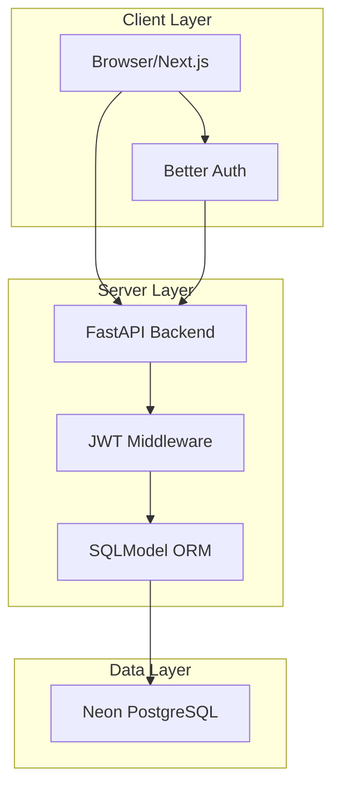

# 🎯 TaskMaster Pro - Advanced Multi-User Todo Application

<div align="center">

[](LICENSE)
[](https://nextjs.org/)
[](https://fastapi.tiangolo.com/)
[](https://www.typescriptlang.org/)
[](https://tailwindcss.com/)

</div>

<p align="center">
  
</p>

<h3 align="center">Secure, Scalable, and Beautiful Task Management Solution</h3>

<p align="center">
  <strong>Experience the power of AI-assisted development with specialized agents!</strong><br>
  Built with cutting-edge technology stack and designed for maximum productivity.
</p>

<div align="center">
  <a href="#features">Features</a> •
  <a href="#tech-stack">Tech Stack</a> •
  <a href="#installation">Installation</a> •
  <a href="#architecture">Architecture</a> •
  <a href="#security">Security</a> •
  <a href="#contributing">Contributing</a>
</div>

---

## 🌟 Key Features

| Feature | Description | Status |
|--------|-------------|---------|
| 🔐 **JWT Authentication** | Secure user authentication with Better Auth | ✅ Complete |
| 👥 **User Isolation** | Strict data separation between users | ✅ Complete |
| 📱 **Responsive UI** | Works seamlessly on all devices | ✅ Complete |
| ⚡ **Real-time Updates** | Instant task synchronization | ✅ Complete |
| 🎨 **Modern Design** | Beautiful UI with Tailwind CSS | ✅ Complete |
| 🛡️ **Security** | Enterprise-grade security protocols | ✅ Complete |

## 🛠️ Tech Stack

<div align="center">

| Layer | Technology | Purpose |
|-------|------------|---------|
| **Frontend** | [Next.js 16.1.15](https://nextjs.org/) | Server-first architecture with App Router |
| **Language** | [TypeScript](https://www.typescriptlang.org/) | Type-safe development |
| **Styling** | [Tailwind CSS](https://tailwindcss.com/) | Utility-first CSS framework |
| **UI Components** | [shadcn/ui](https://ui.shadcn.com/) | Accessible UI components |
| **Backend** | [FastAPI](https://fastapi.tiangolo.com/) | High-performance Python API |
| **Database** | [Neon PostgreSQL](https://neon.tech/) | Serverless PostgreSQL |
| **ORM** | [SQLModel](https://sqlmodel.tiangolo.com/) | SQL database modeling |
| **Authentication** | [Better Auth](https://better-auth.com/) | JWT-based auth system |

</div>

## 🚀 Quick Start

### Prerequisites
- Node.js 18+ 
- Python 3.11+
- PostgreSQL (or Neon PostgreSQL account)
- Docker (optional)

### Installation

1. **Clone the repository**
```bash
git clone https://github.com/yourusername/taskmaster-pro.git
cd taskmaster-pro
```

2. **Set up environment variables**
```bash
cp .env.example .env
# Update with your configuration
```

3. **Install backend dependencies**
```bash
cd backend
pip install -r requirements.txt
```

4. **Install frontend dependencies**
```bash
cd ../frontend
npm install
```

5. **Start the development servers**
```bash
# Terminal 1: Start backend
cd backend && python main.py

# Terminal 2: Start frontend
cd frontend && npm run dev
```

### Using Docker (Recommended)
```bash
docker-compose up
```

## 🏗️ Architecture Overview

<div align="center">



</div>

### 🤖 Specialized AI Agents

Our development approach leverages specialized AI agents for maximum efficiency:

| Agent | Responsibility | Expertise |
|-------|----------------|-----------|
| **🤖 Auth-Security Agent** | Authentication & Security | JWT, OAuth, Security Best Practices |
| **🗄️ DB Architect Agent** | Database Design | SQLModel, PostgreSQL, Migrations |
| **⚡ FastAPI Backend Engineer** | Backend API | FastAPI, Endpoints, Business Logic |
| **📱 NextJS Frontend Agent** | Frontend UI/UX | Next.js, React, Tailwind CSS |
| **🔗 Fullstack Todo Agent** | Fullstack Features | End-to-end Implementation |
| **🧪 Integration Tester** | Testing & QA | API Testing, Integration Tests |
| **🏗️ Project Coordinator** | Project Management | Monorepo, Infrastructure, Coordination |
| **📝 Spec Writer Agent** | Documentation | Specifications, Documentation |

## 🔒 Security Features

<div align="center">

| Security Measure | Implementation | Status |
|------------------|----------------|---------|
| 🔐 **JWT Authentication** | Stateful token verification | ✅ Active |
| 👤 **User Isolation** | Database-level user_id filtering | ✅ Active |
| 🛡️ **Input Validation** | Pydantic models & sanitization | ✅ Active |
| 🚫 **CSRF Protection** | Built-in Next.js protections | ✅ Active |
| 🔍 **Rate Limiting** | Per-user request limits | 🔄 Planned |
| 📊 **Audit Logging** | Action tracking & monitoring | 🔄 Planned |

</div>

## 🎨 UI/UX Highlights

### 🎯 Task Management Interface
- **Clean, Minimalist Design**: Focus on usability and productivity
- **Intuitive Controls**: Easy task creation, editing, and deletion
- **Visual Feedback**: Clear indicators for task status and loading states
- **Responsive Layout**: Perfect experience on mobile, tablet, and desktop

### 🌈 Color Scheme
- **Primary**: `#3B82F6` (Blue) - Actions and highlights
- **Secondary**: `#10B981` (Green) - Success and completion states  
- **Accent**: `#8B5CF6` (Purple) - Special features and notifications
- **Neutral**: `#6B7280` (Gray) - Text and backgrounds

### 🎨 Design Principles
- **Consistency**: Uniform components and interactions
- **Accessibility**: WCAG 2.1 AA compliant
- **Performance**: Optimized loading and interactions
- **User-Centric**: Designed with user workflows in mind

## 🧪 Testing Strategy

```typescript
// Example of our comprehensive testing approach
describe('Task Management', () => {
  test('should allow user to create task', async () => {
    // Implementation
  });
  
  test('should enforce user isolation', async () => {
    // Implementation
  });
  
  test('should validate JWT tokens', async () => {
    // Implementation
  });
});
```

## 🤝 Contributing

We welcome contributions! Here's how you can help:

1. **Fork the Project**
2. **Create a Feature Branch** (`git checkout -b feature/AmazingFeature`)
3. **Commit Changes** (`git commit -m 'Add some AmazingFeature'`)
4. **Push to Branch** (`git push origin feature/AmazingFeature`)
5. **Open a Pull Request**

### 📋 Development Guidelines

- Follow the [spec-driven development](.specify/) approach
- Maintain type safety across all components
- Write comprehensive tests for new features
- Follow the established architecture patterns
- Ensure user isolation in all database operations

## 📄 License

Distributed under the MIT License. See `LICENSE` for more information.

## 📞 Support

- 📧 **Email**: support@taskmasterpro.com
- 💬 **Discord**: [Join our community](https://discord.gg/taskmasterpro)
- 🐛 **Issues**: [Report bugs](https://github.com/yourusername/taskmaster-pro/issues)

<div align="center">

### 🌟 Show Your Support

Give a ⭐ if this project helped you!

[](https://buymeacoffee.com/taskmasterpro)

</div>

---

<div align="center">

**TaskMaster Pro** - *Transforming productivity with AI-powered development*

Made with ❤️ by the TaskMaster Pro Team

</div>